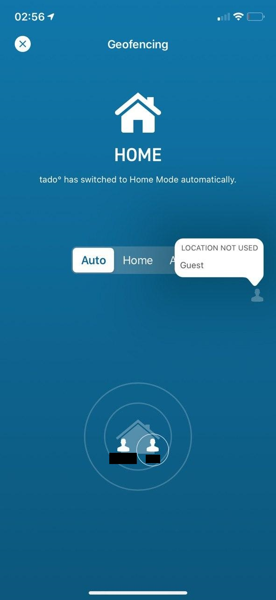
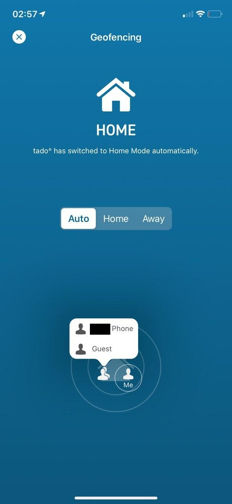

# tado_guestmode by [@whatdaybob](https://github.com/whatdaybob)

## What is it

[Tado°](https://www.tado.com/) although great, is lacking one feature that I desperately needed, a guest mode. In short we had a babysitter and me and the other half went out and enjoyed some freedom from parenting, stupidly we forgot the heating was automated by our geolocation and the heating shut off. Normally this would be ok as you can manually control them but the techphobia was strong in our babysitter. Sure we/you can manually set the house to home but that requires an ingredient I dont have, effort. Plus what's the point in smart heating and a smart home if you dont make it work for  you.

<!-- markdownlint-disable MD033 -->


<!-- markdownlint-enable MD033 -->

## How do I use it

Fire up the docker and it will serve a rest api for you. With this you can add the guest device, delete the guest device, check the status of the geoTracking and enable/disable it for the guest device. All you need to do is take your smarthome controller and call what you need to do. Once the device is added and geoTracking enabled it will be like someone with the mobile application is home.

The endpoints will be served from your docker hosts ip address on port 80 (which you will remap if needed).

| Endpoint | Purpose |
| :----: | --- |
| `/add` | Adds the guest device and sets it's location to your home |
| `/remove` | Destroys the guest device |
| `/status` | Check if the geoTracking on the device is enabled |
| `/enable` | Enables geoTracking on the guest device |
| `/disable` | Disables geoTracking on the guest device |

Technically once you create a guest device you won't need to remove it, just toggle on and off the geoTracking when you have a guest.

## Great how do I get started

Obviously its a docker image so you need docker, if you don't know what that is you need to look into that first.

### docker

```console
docker create \
  --name=tado_guestmode \
  --restart unless-stopped \
  -p 80:80 \
  -v /path/to/config:/config \
  whatdaybob/tado_guestmode
```

### docker-compose

```yaml
---
version: '3.4'
services:
  tado_guestmode:
    image: whatdaybob/tado_guestmode
    container_name: tado_guestmode
    ports: [
      '80:80'
    ]
    volumes: [
      '/path/to/config:/config',
    ]
```

### Docker parameters

| Parameter | Function |
| :----: | --- |
| `-p 80` | The port for the rest interface |
| `-v /config` | tado_guestmode config folder location |

## Configuration file

On first run the docker will create a template file in the config folder.

```yaml
tado:
  user: tadouser@email.com
  pass: mytadopassword
  # don't change below unless it stops working, can be obtained via https://my.tado.com/webapp/env.js
  secret: wZaRN7rpjn3FoNyF5IFuxg9uMzYJcvOoQ8QWiIqS3hfk6gLhVlG57j5YNoZL2Rtc
```

Copy the `config.yml.template` to a new file called `config.yml` and edit accordingly.

If I helped in anyway and you would like to help me, consider donating a lovely beverage with the below.

<!-- markdownlint-disable MD033 -->
<a href="" target="_blank"></a>
<!-- markdownlint-enable MD033 -->